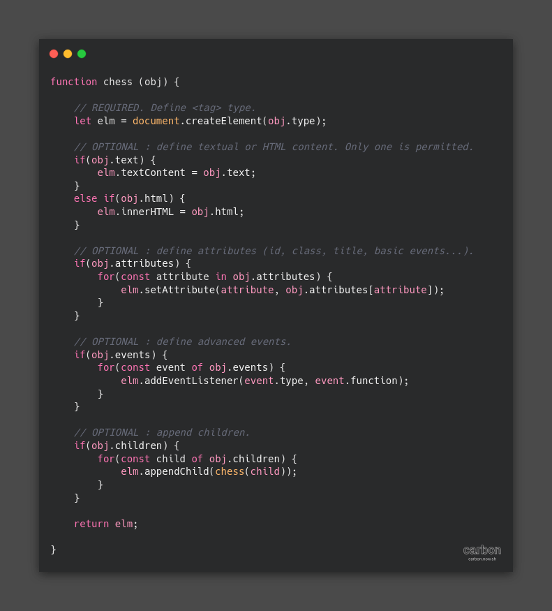

# chess

## What is chess ?

Chess, whose acronym actually means "*Create HTML Elements Short Syntax*", is **a function** that responds to **a single use** and thus defined: **to gain in productivity and readability in the declaration and initialization of its HTML elements** with JavaScript.

Chess is very **light**, but really **useful**. It can **lighten** and **improve the readability** of your source code **without losing performance**.

## Some benefits

* With Chess, your code is **shorter**, **more airy**, but also **more aesthetic**. Which makes it all the **more (re)readable**.
* With Chess, the HTML structure described is **visually represented**: each child stands out from its parent with the logical indentation of the various nestings.
* The Chess approach is **very intuitive**: it is easy to declare children on the fly from their parent without having to repeat the call to the Chess function.
* With Chess, **no variable is created outside** of the function.

## Interest by the performance ?  

Take a look at [this file to run live performance tests](./perf.html).  
On average, Chess allows you to **write 40-50% less script**.